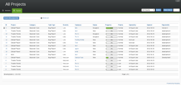
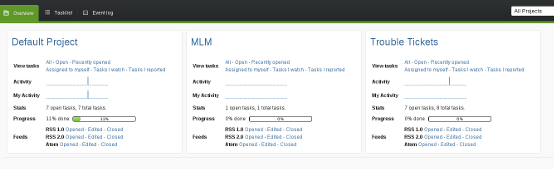
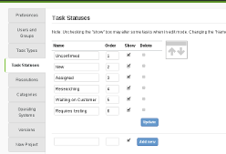
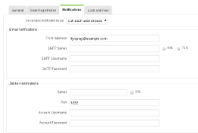
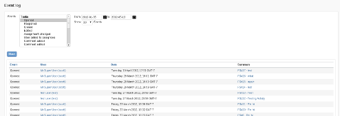
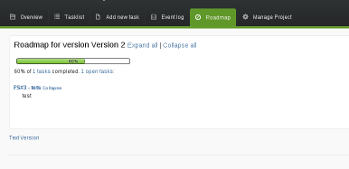

	

	Flyspray is a lightweight, web-based bug tracking system written in PHP for assisting with software development and project managements. Originally developed for the <a href="http://www.psi-im.org/">Psi Jabber client</a> project it has been made available to everyone under the LGPL 2.1 licence. Flyspray aims to cut out the unnecessary complexity of other bug trackers focusing on a very intuitive design making it very easy to effectively manage projects.
	

	

		<a class="btn btn-success btn-lg" href="{{ site.baseurl }}/docs/download">Download</a>
		<a class="btn btn-info btn-lg" href="{{ site.baseurl }}/community/mailing-list">Mailing List</a>
		<a class="btn btn-primary btn-lg" href="{{ site.baseurl }}/manual">Manual</a>
	

	

		<h2>News</h2>
		
			<h3><a href="{{ site.baseurl }}{{ news.url }}">{{ news.title }}</a></h3>
			{{ news.date | date: "%Y-%m-%d" }}: {{ news.summary }}
			

	        
	

	

		

			<h3>Features Include:</h3>
			<ul>
				<li>Web-based, OS-independent, written in PHP</li>
				<li>Multiple database support, currently MySQL and PostgreSQL</li>
				<li>Easy installation</li>
				<li>Easy to use</li>
				<li>Multiple projects</li>
				<li>'Watching' tasks, with notification of changes (email, xmpp, on page)</li>
				<li>Comprehensive task history</li>
				<li>File attachments</li>
				<li>CSS themes</li>
				<li>Advanced search features (though easy to use)</li>
				<li>Atom/RSS feeds</li>
				<li>Two syntax options for task descriptions and more (Dokuwiki / HTML)</li>
				<li>Voting for tasks</li>
				<li>Dependency graphs</li>
				<li>Activity Bars for projects and user activity</li>
				<li>Comments</li>
				<li>Roadmaps ('milestones', 'versions')</li>
				<li>Powerful permission system with customizable global and project based roles</li>
				<li>Filter and export of tasks as CSV for example usage by spreadsheet programs</li>
				<li>optional Single Sign-on using OAuth2 (Facebook, Google, ..)</li>
				<!-- 
				people can activate mass operations on their own risc, needs more validations checks.
				(single user or small setups who do not need email notifications or history protocols of each task change)
				-->
				<!-- <li>mass operation</li> -->
			</ul>
		

	

<h3>Screenshots</h3>

  

    
  

  

    
  

  

    
  

  

    
  

  

    
  

  

    
  

